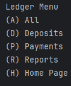

DESCRIPTION OF PROJECT
ACCOUNT LEDGER APPLICATION
This applications is to keep track of all financial transactions 
Overall Application Map

The application needs to be able to 
- D- Add a deposit
- P- Make a payment
- L- Display ledger
- X- Exit the app

Deposit: 
Payment: 

The ledger has various display options
- A- Show all transactions
- D- Show all deposits
- P- Show all payments
- R- Show other display options
- H- Home- Gop back to home page 

Report Filters
- Month to Date
- Previous Month
- Year to Date
- Previous Year
- Search by vendor
- Back to ledger

INTERESTING PIECE OF CODE

public class Ledger {
// Transactions are made up of 5 class field variables
// The ledger is made up of a list of transactions
// The transactions as defined bt the information in the transactions class
private final List<Transactions> transactions;

    // Constructor named Ledger. (parameter)
    public Ledger(String filePath) {

        // Updates the list to be an array list
        this.transactions = new ArrayList<>();

        try {
            // Makes an object that can read a line at a time from the transactions.csv file
            BufferedReader reader = new BufferedReader(new FileReader(filePath));
            // Makes a header and tells the computer to skip the header
            String header = reader.readLine();

            String line;
            // While-Loop
            // When line is = to reader and there is no text, the loop is finished
            while ((line = reader.readLine()) != null) {
                // Make an array named parts. Split by '|'
                String[] parts = line.split("\\|");

                // If the array has 5 parts.
                // This is because we want all 5 pieces of information to make a transaction
                if (parts.length == 5) {
                    // names each index
                    String date = parts[0].trim();
                    String time = parts[1].trim();
                    String transactionDescription = parts[2].trim();
                    String vendorName = parts[3].trim();
                    double depositAmount = Double.parseDouble(parts[4].trim());

                    // Transaction named t. Needs 5 parameters.
                    Transactions t = new Transactions(date, time, transactionDescription, vendorName, depositAmount);
                    // Add it to the end of the transaction
                    transactions.add(t);
                }
            }
        } catch (IOException e) {
            e.printStackTrace();
        }
    }

10/10/2025- Made transactions.csv file and added 4 items
Started creating the homepage
Created a transactions file 

10/14/2025
Completed the first options for the user
Created else-if loops for all options on main page
Created Transactions class
-Made setters
-Made getters
-Made constructors

10/15/2025
-Completed deposit option
-Fixed a few bugs for formatting and clarity  
-Completed payment option
-Started Ledger class 
-Moved try catch for code clarity
-Started reportsMenu method
-Created switch statement 
-Created methods to handle each choice in reports 
-Made outline diagram of options available to user

10/16/2025
-Added notes to entire projects

10/17/2025
- Formatted text for clarity
- Added images to read me and my interesting code
